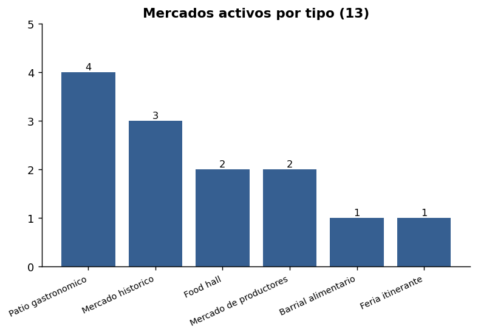
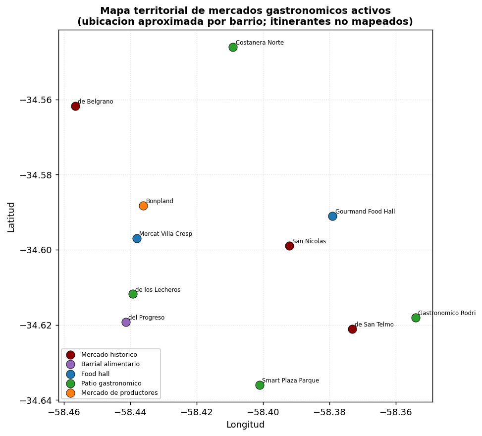
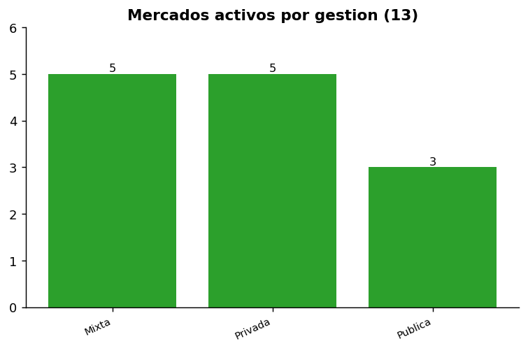
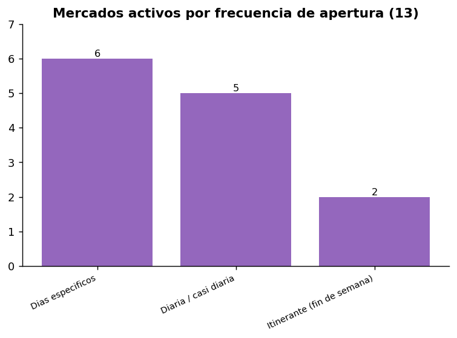
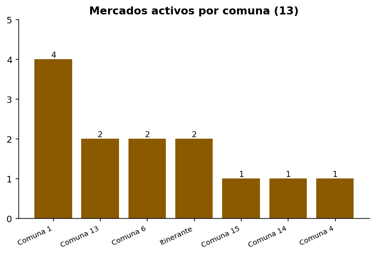

# Mercados gastronómicos en la Ciudad de Buenos Aires

### Informe final — relevamiento, mapa y lectura ejecutiva

**DataGastro** · Elaborado por **Diego Aleman** · **Versión V3** · 2026-06-24

---

## 1. Portada

Panorama de los **mercados gastronómicos activos** de la Ciudad de Buenos Aires: dónde están, qué
ofrecen, cómo se gestionan y qué oportunidades abren para la Ciudad. Documento ejecutivo, pensado
para lectura institucional. Es un relevamiento documental con fuentes públicas; **no** es un censo
ni un padrón oficial.

## 2. Resumen ejecutivo

- La Ciudad cuenta con **13 mercados gastronómicos activos confirmados**: **11 de sede fija** y
  **2 itinerantes**.
- Conviven **mercados históricos** (San Telmo, Belgrano, San Nicolás), **food halls** privados
  (Mercat Villa Crespo, Gourmand Food Hall), **patios gastronómicos** públicos/mixtos (Lecheros,
  Smart Plaza, Costanera Norte, Rodrigo Bueno) y **mercados de productores / ferias** (Bonpland,
  Sabe la Tierra, Buenos Aires Market), más el clásico barrial **Mercado del Progreso**.
- La **gestión está repartida**: 5 privados, 5 mixtos y 3 públicos.
- Hay **3 espacios relevantes no contabilizados** por señales de cierre o falta de actividad
  reciente (Mercado Soho, Mercat Caballito, El Galpón) y **1 cerrado** (Mercado de los Carruajes).
- Se abren oportunidades concretas de **turismo gastronómico, desarrollo local y revitalización
  barrial**.

## 3. Indicadores principales

| Indicador | Valor |
|---|---|
| Mercados activos confirmados | **13** |
| Sede fija / itinerantes | 11 / 2 |
| Mercados históricos | 3 |
| Food halls | 2 |
| Patios gastronómicos | 4 |
| Mercados de productores | 2 |
| Feria gastronómica itinerante | 1 (+1 productores itinerante) |
| Gestión pública / privada / mixta | 3 / 5 / 5 |
| Con horario confirmado | 11 |
| Comunas con presencia | 6 |

## 4. Qué se entiende por mercado gastronómico

Un espacio donde la **gastronomía, los alimentos o los productores son el eje central**: mercados
históricos con oferta de comida, food halls curados, patios gastronómicos, mercados de productores
y ferias gastronómicas. Quedan **fuera** los mercados de pulgas/antigüedades, shoppings, outlets,
supermercados y los mercados de abasto sin propuesta gastronómica.

## 5. Universo activo identificado

13 mercados activos confirmados. Detalle completo en la **tabla final** (sección 17) y en
`mercados_gastronomicos_activos_v3.csv`.

## 6. Mapa territorial

Mapa interactivo: `mapa_mercados_gastronomicos_v3.html` (ubicación aproximada por barrio; los dos
itinerantes no se mapean por tener sede variable).

## 7. Tipologías de mercados

- **Mercados históricos (3):** edificios patrimoniales reconvertidos (San Telmo, Belgrano,
  San Nicolás); alto valor identitario y turístico.
- **Food halls (2):** Mercat Villa Crespo y Gourmand Food Hall; gastronomía curada como atractivo.
- **Patios gastronómicos (4):** Lecheros, Smart Plaza Parque Patricios, Costanera Norte, Rodrigo
  Bueno; gestión pública/mixta y rol barrial.
- **Mercados de productores (2):** Bonpland y Sabe la Tierra; economía social y consumo consciente.
- **Barrial alimentario (1):** Mercado del Progreso.
- **Feria gastronómica itinerante (1):** Buenos Aires Market.

## 8. Gestión pública, privada y mixta

La oferta combina **iniciativa privada** (food halls, Progreso, itinerantes) con un **rol activo
del Estado** en patios públicos y mercados municipales reconvertidos, y modelos **mixtos** de
concesión o economía social.

## 9. Horarios y funcionamiento

- **Diaria o casi diaria:** San Telmo, Belgrano, Lecheros, Smart Plaza, Gourmand.
- **Días específicos:** Progreso, Mercat Villa Crespo, Bonpland, Costanera Norte, Rodrigo Bueno,
  San Nicolás.
- **Itinerantes (fin de semana):** Buenos Aires Market, Sabe la Tierra.

Horarios confirmados en 11 de 13; San Telmo presenta fuentes divergentes y los itinerantes
dependen de la sede. Detalle en `horarios_mercados_gastronomicos_v3.csv`.

## 10. Públicos objetivo

- **Turístico alto:** San Telmo, Gourmand Food Hall.
- **Barrial alto:** Progreso, Lecheros, Smart Plaza, Rodrigo Bueno.
- **Consumo consciente / productores:** Bonpland, Sabe la Tierra, Buenos Aires Market.
- **Mixto:** Belgrano, Mercat Villa Crespo, San Nicolás, Costanera Norte.

Detalle en `publicos_objetivo_mercados_v3.csv`.

## 11. Perfil de oferta gastronómica

Tres grandes lógicas conviven: **abasto + gastronomía** (mercados históricos y barriales),
**gastronomía curada gourmet** (food halls) y **productores / economía social** (Bonpland,
Sabe la Tierra, Buenos Aires Market). Los patios públicos suman **comida al paso y propuesta
cultural** al aire libre.

## 12. Lectura territorial

Presencia en **6 comunas**, con concentración en **Comuna 1** (San Telmo, San Nicolás, Rodrigo
Bueno, Gourmand) y **Caballito (Comuna 6)** (Progreso, Lecheros). Palermo, Belgrano, Villa Crespo,
Parque Patricios y la ribera completan el mapa. Es una lectura de **volumen documentado**, no de
densidad.

## 13. Casos no activos o cerrados recientes

- **En revisión (no contabilizados):** **Mercado Soho**, **Mercat Caballito** y **El Galpón** —
  espacios gastronómicos relevantes con **señales de cierre o falta de actividad reciente**
  verificable; se excluyen del conteo hasta nueva validación.
- **Cerrado documentado:** **Mercado de los Carruajes** (cerró en abril 2025; se reconvierte a
  eventos).

## 14. Oportunidades para la Ciudad

- **Turismo gastronómico:** integrar San Telmo, Belgrano y Gourmand en circuitos.
- **Desarrollo local y economía social:** fortalecer Bonpland, Sabe la Tierra, Buenos Aires Market
  y Rodrigo Bueno.
- **Revitalización barrial:** usar los patios públicos (Lecheros, Smart Plaza, Costanera Norte)
  como dinamizadores.
- **Registro unificado:** crear un catálogo oficial actualizado con tipologías y estado operativo.
- **Información pública:** estandarizar horarios, oferta y gestión.

Detalle en `oportunidades_politica_publica_mercados_v3.csv`.

## 15. Próximos pasos recomendados

1. **Validar en terreno** los 3 casos en revisión (pueden volver al conteo).
2. **Cerrar horarios divergentes** (San Telmo) y datos faltantes.
3. **Mantener un monitoreo periódico** de aperturas/cierres con DataGastro.
4. **Revisar posibles omitidos** prioritarios (ferias de productores, nuevos food halls).

## 16. Nota metodológica breve

El relevamiento integra **fuentes públicas oficiales, sitios propios, fuentes internas
sanitizadas, Google Places y revisión documental complementaria**. Los casos con señales
contradictorias se excluyen del conteo activo hasta nueva validación. No se exponen datos
sensibles. Respaldo completo en `ANEXO_TECNICO_MERCADOS_GASTRONOMICOS_CABA_V3.md`.

## 17. Tabla final de mercados activos (13)

| Nombre | Tipo | Gestión | Barrio | Comuna | Horario | Público |
|---|---|---|---|---|---|---|
| Mercado de San Telmo | histórico | mixta | San Telmo | 1 | 9–22 (a confirmar) | turístico/barrial |
| Mercado de Belgrano | histórico | mixta | Belgrano | 13 | frescos 8:30–20; gastro 11–24 | barrial/turístico |
| Mercado del Progreso | barrial alimentario | privada | Caballito | 6 | Lun–Sáb (mañana y tarde) | barrial |
| Mercat Villa Crespo | food hall | privada | Villa Crespo | 15 | Mar–Dom 12–23/01 | mixto |
| Patio de los Lecheros | patio gastronómico | pública | Caballito | 6 | todos los días 9–24+ | barrial/turístico |
| Mercado Bonpland | productores | mixta | Palermo | 14 | Mar/Mié/Vie/Sáb 10–19 | barrial/consciente |
| Smart Plaza Parque Patricios | patio gastronómico | pública | Parque Patricios | 4 | todos los días 11–24+ | barrial |
| Patio Costanera Norte | patio gastronómico | mixta | Costanera Norte | 13 | Mié–Dom 12–24 | turístico |
| Patio Rodrigo Bueno | patio gastronómico | pública | Puerto Madero | 1 | Vie–Dom 11–23 | barrial |
| Mercado San Nicolás | histórico | mixta | San Nicolás | 1 | mercado 8–18; gastro 11–24 | barrial |
| Buenos Aires Market | feria itinerante | privada | itinerante | — | fin de semana (por sede) | barrial/turístico |
| Sabe la Tierra | productores itinerante | privada | itinerante | — | fin de semana (por sede) | consciente |
| Gourmand Food Hall | food hall | privada | Retiro | 1 | todos los días 10–23+ | turístico |
