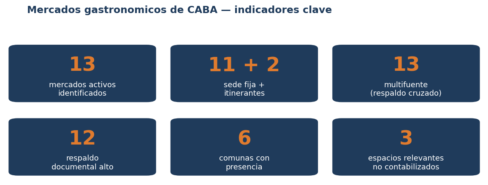
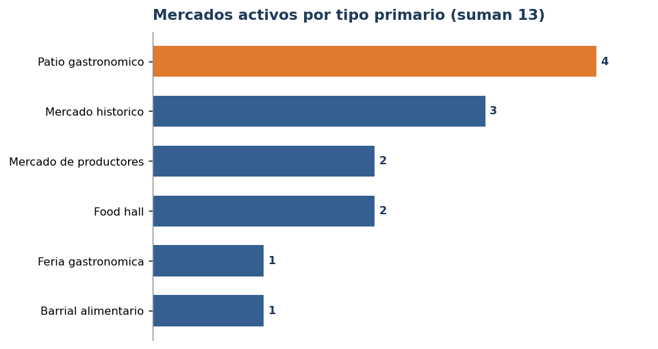
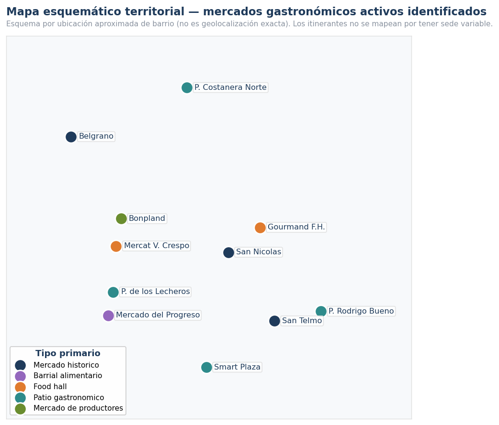
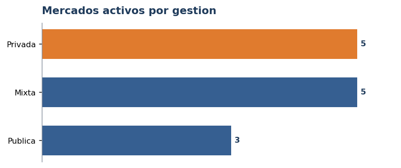
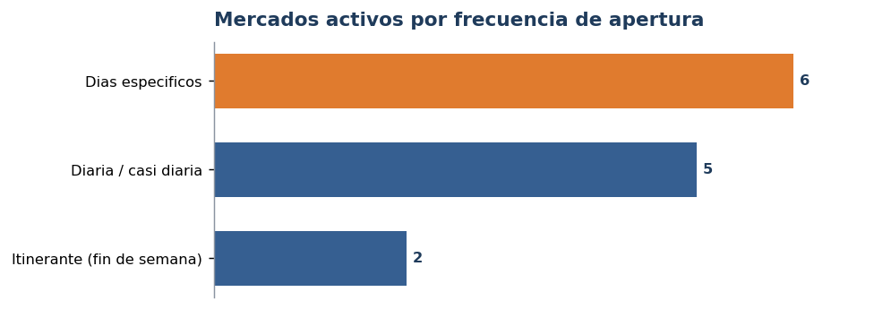
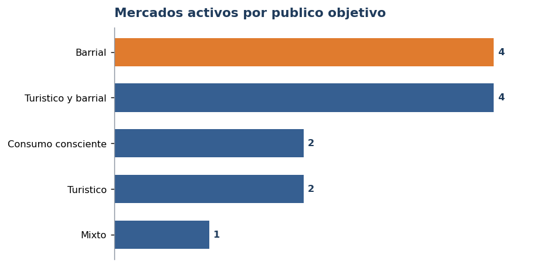
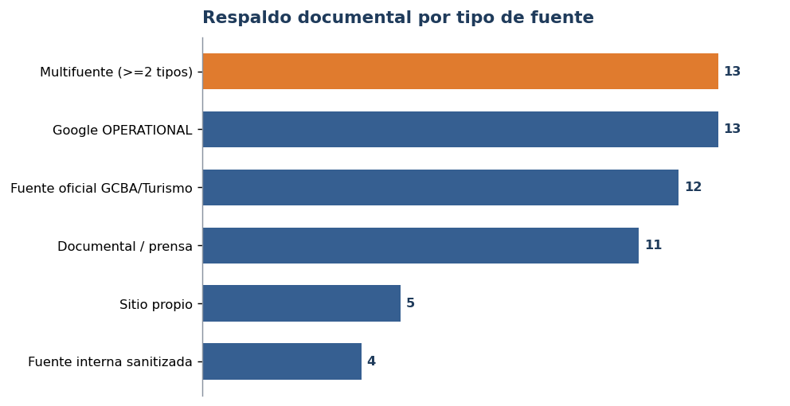

# DataGastro — Diagnóstico territorial gastronómico

## Mercados gastronómicos en la Ciudad de Buenos Aires

**Universo activo identificado, tipologías y lectura territorial**

_Análisis y desarrollo: Diego Aleman · Versión V4 · 2026-06-24_

> Relevamiento documental y multifuente. **No constituye censo ni padrón oficial.** Es una base
> analítica para orientar validaciones territoriales y decisiones de política pública.

---

## 1. Portada

Panorama de los **mercados gastronómicos activos identificados** de la Ciudad de Buenos Aires:
cuántos son, de qué tipo, dónde están, quién los gestiona, cuándo abren, a quién apuntan y qué
respaldo documental tienen. Documento ejecutivo de la familia DataGastro.

## 2. Resumen ejecutivo

**Respuesta:** La Ciudad cuenta con **13 mercados gastronómicos activos identificados** (11 de
sede fija + 2 itinerantes), repartidos en **6 comunas**, con **gestión** 3 pública / 5 privada /
5 mixta. Los **13** tienen **respaldo multifuente** y **12** alcanzan respaldo documental alto.

**Cuidado metodológico:** "identificados" no equivale a "confirmados en terreno". Es respaldo
documental, no validación territorial.

## 3. ¿Cómo se construyó el universo identificado?

**Respuesta:** Se integraron **fuentes públicas oficiales** (GCBA, Turismo BA, BA Capital
Gastronómica), **sitios propios** de los mercados, **fuentes internas sanitizadas** (DGDGAS, solo
metadata), **Google Places** (señal operativa no oficial) y **revisión documental** (prensa con
URL visible). Cada mercado se clasifica por su respaldo cruzado.

**Cuidado metodológico:** los casos con señales contradictorias se excluyen del conteo activo
hasta nueva validación; no se descartan, quedan documentados.

## 4. ¿Cuántos mercados gastronómicos activos hay y de qué tipo?

**Respuesta:** **13 activos identificados.** Cada mercado tiene un **tipo primario único**, de modo
que las categorías suman exactamente 13, sin doble conteo.

Patios gastronómicos (4) y mercados históricos (3) encabezan; food halls (2) y mercados de
productores (2) completan, con un barrial alimentario y una feria gastronómica.

**Cuidado metodológico:** "itinerante" y "productores" se tratan como **atributos** (no como tipo),
para no inflar el conteo.

## 5. ¿Dónde están?

**Respuesta:** Presencia en **6 comunas**, con concentración en la **Comuna 1** (San Telmo, San
Nicolás, Rodrigo Bueno, Gourmand) y en **Caballito** (Progreso, Lecheros).

**Cuidado metodológico:** las coordenadas son **aproximadas por barrio** (lectura territorial, no
geolocalización exacta); los itinerantes no se mapean por tener sede variable.

## 6. ¿Quién los gestiona?

**Respuesta:** La oferta combina **iniciativa privada** (5), **gestión mixta** de concesión o
economía social (5) y **gestión pública** del GCBA (3).

**Cuidado metodológico:** la gestión exacta de algunos casos mixtos (concesión) se apoya en
normativa pública y puede precisarse con el pliego correspondiente.

## 7. ¿Cuándo abren?

**Respuesta:** Conviven mercados de **operación diaria o casi diaria**, de **días específicos** y
**itinerantes** de fin de semana.

**Cuidado metodológico:** 11 de 13 tienen horario documentado; San Telmo presenta fuentes
divergentes y los itinerantes dependen de la sede.

## 8. ¿A quién apuntan?

**Respuesta:** Predominan los perfiles **barrial** y **turístico/barrial**, con un núcleo de
**consumo consciente** (productores) y casos de fuerte perfil **turístico**.

**Cuidado metodológico:** el perfil de público es una lectura cualitativa orientativa, no una
medición de afluencia.

## 9. Casos patrimoniales y mercados con identidad histórica

**Respuesta:** Varios mercados activos tienen **identidad histórica, barrial o patrimonial
documentada**: **Mercado de San Telmo** (1897), **Mercado de Belgrano** (1891), **Mercado del
Progreso** (1889, sitio de interés cultural), **Mercado San Nicolás** (mercado centenario
renovado) y **Mercado Bonpland** (referente de economía social).

**Cuidado metodológico:** se señalan por su trayectoria documentada; no es un ranking histórico
exhaustivo.

## 10. ¿Qué espacios quedaron afuera y por qué?

**Respuesta:** Quedan **fuera del conteo activo** (sin descartarse):

- **Espacios relevantes no contabilizados (3):** Mercado Soho, Mercat Caballito, El Galpón —
  **señales de cierre o falta de actividad reciente**; vuelven al conteo si se valida actividad.
- **Cerrado documentado (1):** Mercado de los Carruajes (cerró en 2025).
- **No gastronómicos / fuera de alcance:** distritos (Barrio Chino, Los Arcos del Rosedal),
  abasto barrial (Pompeya, Villa Pueyrredón, Primera Junta), pulgas y outlet.

**Cuidado metodológico:** no son errores; son categorías diferenciadas para no mezclar universos.

## 11. ¿Qué decisión permite tomar este informe?

**Respuesta:** Cuatro líneas de acción:

1. **Priorizar circuitos turísticos gastronómicos** (San Telmo, Belgrano, Gourmand).
2. **Fortalecer mercados de productores y economía social** (Bonpland, Sabe la Tierra, BA Market).
3. **Usar patios públicos como dinamizadores barriales** (Lecheros, Smart Plaza, Costanera Norte,
   Rodrigo Bueno).
4. **Construir un registro unificado y actualizable** de mercados gastronómicos.

**Cuidado metodológico:** las decisiones que afectan estado operativo (p. ej. casos en revisión)
requieren validación territorial previa.

## 12. Referencias documentales visibles

**Respuesta:** Cada mercado se apoya en fuentes con **URL visible** (GCBA, Turismo BA,
Argentina.gob.ar, sitios propios, prensa y Boletín Oficial para el régimen de concesiones). El
detalle está en `referencias_documentales_visibles_v4.csv`.

**Cuidado metodológico:** aparecer en más de una fuente aumenta el **respaldo documental**, no
prueba por sí solo la actividad actual.

## 13. Limitaciones y cuidado metodológico

Relevamiento **documental**; no reemplaza validación territorial ni al registro oficial. Google
Places es señal no oficial. Horarios autodeclarados y a veces divergentes. Coordenadas aproximadas
por barrio. El respaldo documental alto/medio/básico **no** equivale a confianza territorial.

## 14. Tabla final de mercados activos (13)

| Nombre | Tipo primario | Gestión | Barrio | Comuna | Respaldo |
|---|---|---|---|---|---|
| Mercado de San Telmo | histórico | mixta | San Telmo | 1 | alto |
| Mercado de Belgrano | histórico | mixta | Belgrano | 13 | alto |
| Mercado San Nicolás | histórico | mixta | San Nicolás | 1 | alto |
| Mercado del Progreso | barrial alimentario | privada | Caballito | 6 | alto |
| Mercat Villa Crespo | food hall | privada | Villa Crespo | 15 | alto |
| Gourmand Food Hall | food hall | privada | Retiro | 1 | alto |
| Patio de los Lecheros | patio gastronómico | pública | Caballito | 6 | alto |
| Smart Plaza Parque Patricios | patio gastronómico | pública | Parque Patricios | 4 | alto |
| Patio Costanera Norte | patio gastronómico | mixta | Costanera Norte | 13 | medio |
| Patio Rodrigo Bueno | patio gastronómico | pública | Puerto Madero | 1 | alto |
| Mercado Bonpland | mercado de productores | mixta | Palermo | 14 | alto |
| Sabe la Tierra | mercado de productores (itin.) | privada | itinerante | — | alto |
| Buenos Aires Market | feria gastronómica (itin.) | privada | itinerante | — | alto |

## 15. Qué aporta la metodología DataGastro

Un método **replicable** —registro oficial + sitios propios + señal operativa + fuente interna +
revisión documental— para mapear un rubro, distinguir tipologías, medir respaldo cruzado y separar
con claridad activos, casos en revisión, cerrados y fuera de alcance. Es una **base analítica
candidata**, no oficial: orienta el trabajo territorial y la decisión pública.

_DataGastro · Mercados gastronómicos de CABA_
